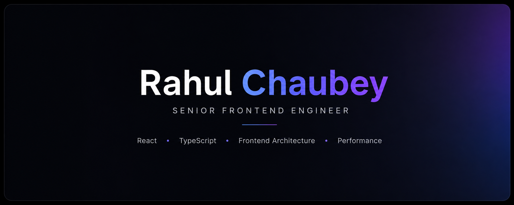

  

# Rahul Chaubey

Senior Full stack Engineer with **5+ years** of experience building scalable, high-performance web applications using **React.js** and **TypeScript** and **Node.js**. Passionate about frontend architecture, performance optimization, and real-time systems.

## Tech Focus

- React.js
- TypeScript
- JavaScript
- Frontend Architecture
- Performance Optimization
- Real-time Systems
- Accessibility (a11y)
- Jest & React Testing Library

## Featured Projects

- React Machine Coding
- Frontend Engineering Playground
- React Component Library
- Real-time Dashboard
- Portfolio

## Connect

Portfolio: https://rahulchaubey.vercel.app/

LinkedIn: https://linkedin.com/in/rahulchaubey

Email: rahulchaubeynitj@gmail.com
